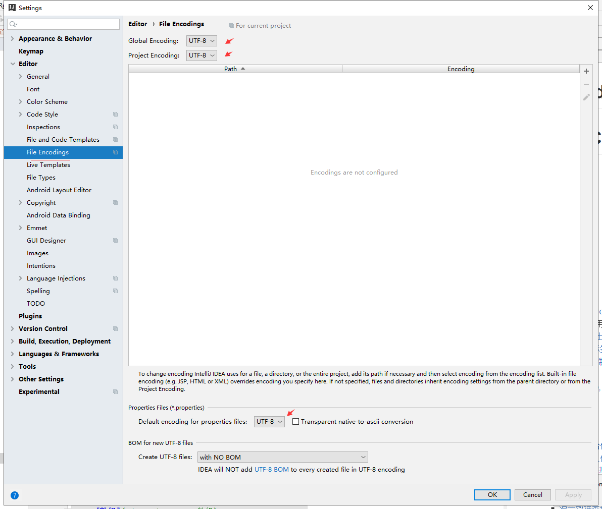
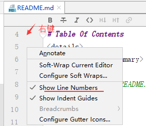
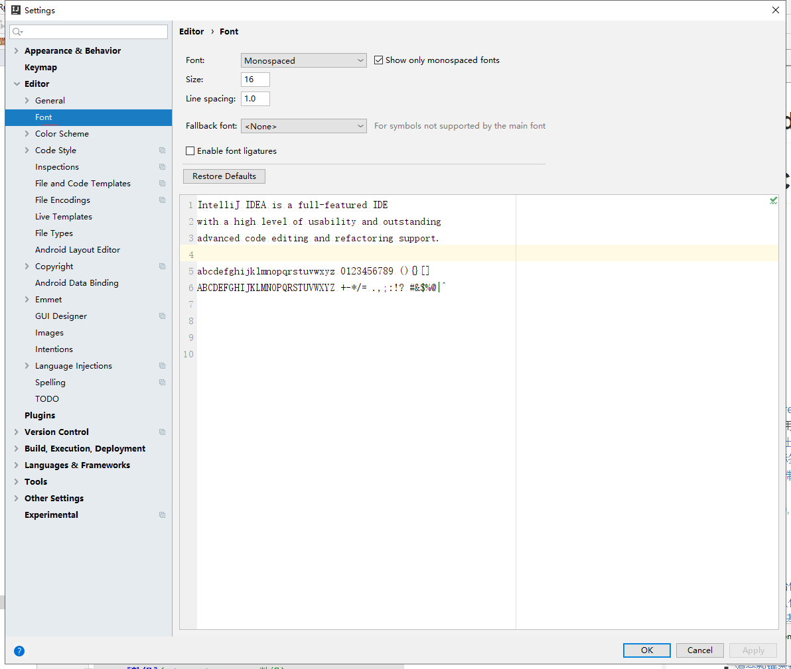
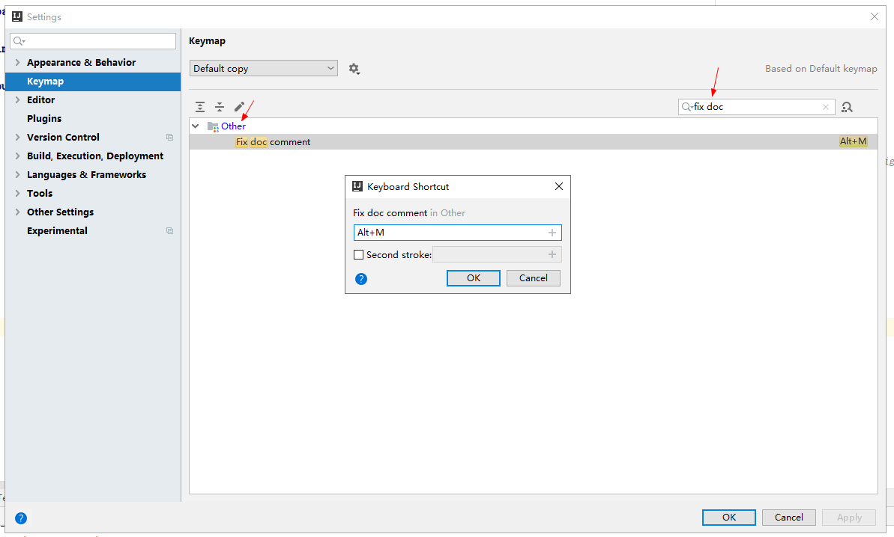

IntelliJ IDE
==


# 字符集设置
建议选择UTF-8  


# 换行符设置
建议选择LF，即Unix and maxOS(\n)


# 显示行号


# 字体、字体大小、行距设置


# Tab键缩进大小设置


# 文件模板设置


# TortoiseGit设置不自动转换换行符
建议安装的git也不自动转换换行符，主要目的是换行符使用LF(\n)
```text
[core]
  autocrlf = false
```


## IDEA设置JavaDOC注释的快捷键
* 方法1:Alt + Enter
```text
这时默认的

把光标停在类名或者方法名上(光标点一下，或选中它)，然后Alt + Enter，出现几个选项，选择Add Javadoc就OK了
```
   
 
 * 设置自定义快捷键
 ```text
    我这里把他设置成Alt + M，你可以设置成其他的
 
Settings ->Keymap ->Other ->Fix doc comment ->右键 ->选择 Add Keyboard Shortcut， 然后输入自定义的快捷键Alt + M、
默认Fix doc comment是没有设置快捷键的

把光标停在类名或者方法名上这行上，然后Alt + Enter，出现几个选项，选择Add Javadoc就OK了
```

  

## 查看类、接口的关系图，或查看modules模块关系图
```text
Ctrl + Alt + U
```
