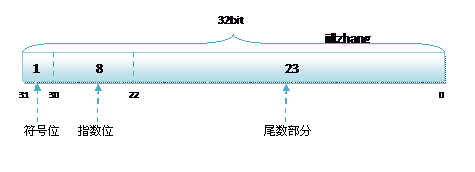
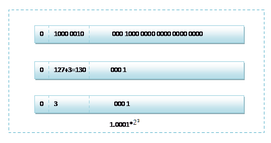

 ##
 从存储结构和算法上来讲，double和float是一样的，不一样的地方仅仅是float是32位的，double是64位的，所以double能存储更高的精度。 
        任何数据在内存中都是以二进制（0或1）顺序存储的，每一个1或0被称为1位，而在x86CPU上一个字节是8位。比如一个16位（2字节）的short int型变量的值是1000，那么它的二进制表达就是：00000011 11101000。由于Intel CPU的架构原因，它是按字节倒序存储的，那么就因该是这样：11101000 00000011，这就是定点数1000在内存中的结构。 
        目前C/C++编译器标准都遵照IEEE制定的浮点数表示法来进行float,double运算。这种结构是一种科学计数法，用符号、指数和尾数来表示，底数定为2——即把一个浮点数表示为尾数乘以2的指数次方再添上符号。下面是具体的规格： 
   
符号位   阶码   尾数   长度 
float           1      8     23       32 
double       1     11    52       64 
临时数       1     15    64       80 

## 
由于通常C编译器默认浮点数是double型的，下面以double为例： 
共计64位，折合8字节。由最高到最低位分别是第63、62、61、……、0位： 
          最高位63位是符号位，1表示该数为负，0正； 
          62-52位，一共11位是指数位； 
          51-0位，一共52位是尾数位。 
   
   
          按照IEEE浮点数表示法，下面将把double型浮点数38414.4转换为十六进制代码。 
          把整数部和小数部分开处理:整数部直接化十六进制：960E。小数的处理: 
          0.4=0.5*0+0.25*1+0.125*1+0.0625*0+…… 

小数的处理(http://blog.csdn.net/lin200753/article/details/27952897)：

## 
在十进制中小数有些是无法完整用二进制表示的。它们只能用有限位来表示，从而在存储时可能就会有误差。十进制的小数采用乘2取整法进行计算，取掉整数部分后，剩下的小数继续乘以2,直到小数部分全为0.

如0.125变成二进制为

0.125*2=0.25  .....取整0

0.25*2＝0.5 ........取整0

0.5*2＝ 1.0 ………取整1

0.0*2＝0

所以0.125的二进制为0.001
0.125 = 0*2

如我们有
而0.9*2=1.8.....取整1
0.8*2=1.6…....取整1
0.6*2=1.2.......取整1
0.2*2=0.4........取整0
0.4*2＝0.8...取整0
0.8*2=1.6....取整1
………………………………
从而它是一个循环，不可能出现小数部分为0的情况。从而在内存中表示时就会小于0.9
         
    实际上这永远算不完！这就是著名的浮点数精度问题。所以直到加上前面的整数部分算够53位就行了（隐藏位技术：最高位的1不写入内存）。 
    如果你够耐心，手工算到53位那么因该是：38414.4(10)=1001011000001110.0110101010101010101010101010101010101(2) 
科学记数法为：1.001……乘以2的15次方。指数为15！ 
          于是来看阶码，一共11位，可以表示范围是-1024~1023。因为指数可以为负，为了便于计算，规定都先加上1023，在这里， 15+1023=1038。二进制表示为：100   00001110 
          符号位：正——   0   ！ 
          合在一起（尾数的表示：去掉小数点前面的1）： 
01000000   11100010   11000001   11001101   01010101   01010101   01010101   01010101 
          按字节倒序存储的十六进制数就是： 
55   55   55   55   CD   C1   E2   40 

网址：http://blog.csdn.net/lai123wei/article/details/7220684

##C语言和C#语言double、float
C语言和C#语言中，对于浮点类型的数据采用单精度类型（float）和双精度类型(double)来存储，float数据占用32bit, double数据占用64bit, 无论是单精度还是双精度在存储中都分为三个部分：

 首先说一下原,反,补,移码. 移码其实就等于补码,只是符号相反. 对于正数而言,原,反,补码都一样, 对负数而言,反码除符号位外,在原码的基础上按位取反,补码则在反码的基础之上,在其最低位上加1,要求移码时,仍然是先求补码,再改符号. 

符号位(Sign) : 0代表正，1代表为负
指数位（Exponent）:用于存储科学计数法中的指数数据，并且采用移位存储  
 A,阶码是用移码表示的,这里会有一个127的偏移量,它的127相当于0,小于127时为负,大于127时为正,比如:10000001表示指数为129-127=2,表示真值为2^2,而01111110则表示2^(-1). 

有移码表示阶码有是有原因的,主要是移码便于对阶操作,从而比较两个浮点数的大小. 这里要注意的是,阶码不能达到11111111的形式,IEEE规定,当编译器遇到阶码为0XFF时,即调用溢出指令.  总之,阶码化为整数时,范围是:-127~127.

float：   符号位1，阶码08(固定偏移     7F)，尾数23，固定隐含位有 
double：符号位1，阶码11(固定偏移   3FF)，尾数52，固定隐含位有 
long   double：符号位1，阶码15(固定偏移3FFF)，尾数64，固定隐含位无 
某些编译器中把long   double作double处理 
尾数部分（Mantissa）：尾数部分
其中float的存储方式如下图所示：

2 精度
float和double的精度是由尾数的位数来决定的。浮点数在内存中是按科学计数法来存储的，其整数部分始终是一个隐含着的“1”，由于它是不变的，故不能对精度造成影响。

float：2^23 = 8388608，一共七位，这意味着最多能有7位有效数字，但绝对能保证的为6位，也即float的精度为6~7位有效数字；

double：2^52 = 4503599627370496，一共16位，同理，double的精度为15~16位。 

 
##
最近看了IEEE754浮点数的表示方法。在C的参考书中有提到float类型数据的表示范围为-3.4*10^38～+3.4*10^38。究竟如何计算该范围，分析如下：

对于单精度浮点数（float）来说，有一位符号位，指数位共8位，尾数共23位。指数能够表示的指数范围为-128~127。尾数为23位。当尾数全1时再加上小数点前面的1，指数取到最大正数127（8位，正数最大127，负数最小-128）,浮点数取得正数的最大值。

+1.111111111111111111111*2^127（1.后面23个1，由于尾数的范围1～2，其最高位总为1，故只需存取小数部分，所以小数为是23位1），约等于2*2^127=3.4*10^38。为3.4*10^38负数亦然。

Double的计算与此类似，double的符号位为63位，指数为62～52位，共11位。表示的范围为-1024～1023。尾数为51～0。表示的范围为+1.111111111111111111111*2^1023（1.后面52个1）为1.7*10^308。负数亦然。