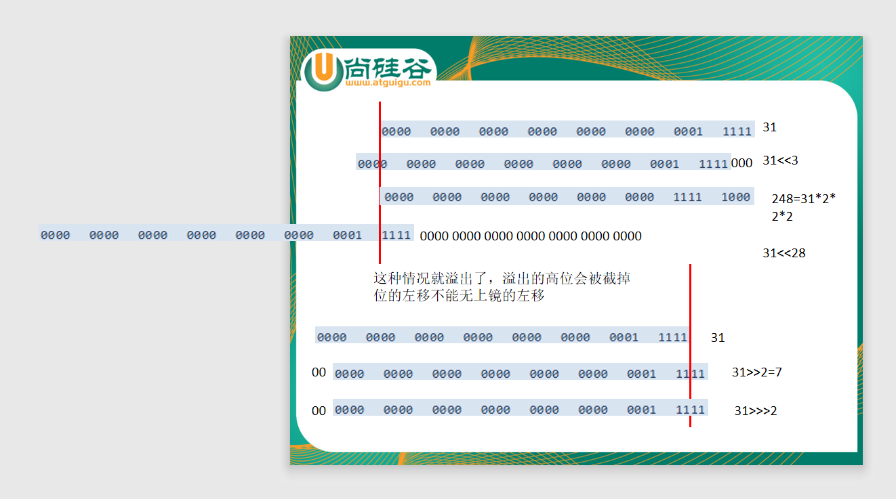
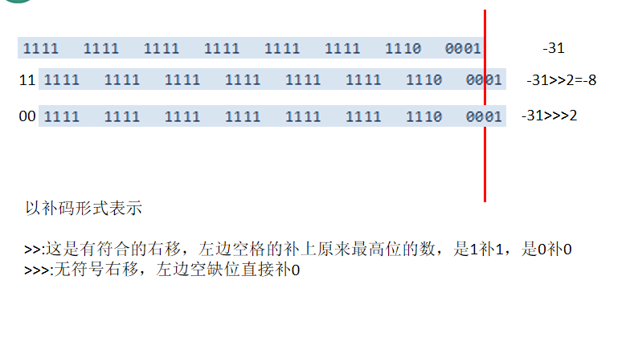
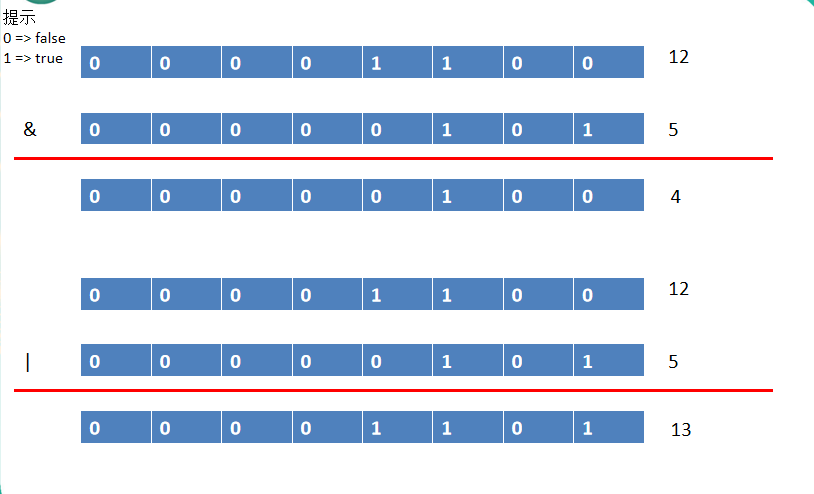
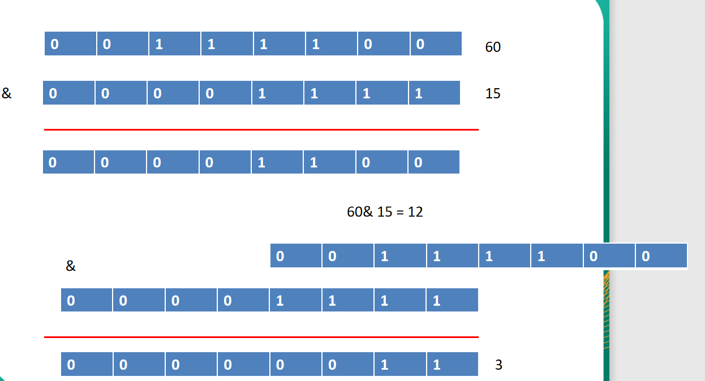

day02_03 赋值运算符与比较运算符的使用
==


# 赋值运算符
* 符号：=
>当"="两侧数据类型不一致时，可以使用自动类型转换或使用强制类型转换原则进行处理

> 支持连续赋值。

* 扩展赋值运算符：+=, -+, *=, /=, %=
>扩展赋值不会改变原来值的类型

# 比较运算符
|运算符 |运算 |示例 |结果 |
|:---|:---|:---|:---|
|== |相等于|4 == 3 |false |
|!= |不等于 |4 != 3 |true |
|< |小于 |4 < 3 |false |
|\> |大于 |4 > 3 |true |
|<= |小于等于 |4 <= 3 |false |
|>= |大于等于 |4 >= 3 |true |
|instanceof |检查是否是类的对象 |"Hello" is instanceof String |true |

>比较运算的结果都是boolean型，要么是true,要么是false

>比较运算符"==" 不能写成"="
==：等于
=：赋值


# 逻辑运算符
```text
& 逻辑与
| 逻辑或
! 逻辑非
^ 逻辑异或（表示比较的两个对象为不同值时，为真，即必须一个为真一个为假时结果才为真，否则为假，）  
     左右两边想异为真，否则为假    
&& 短路与
|| 短路或


```

* 逻辑运算符用于连接布尔型表达式，表达式的结果必须为boolean类型
>在Java中不可以写成 3<x<6，应该写成 x > 3 && x < 6

* & 和 && 的区别

>&：左边无论true或false，右边都进行运算

>&&：如果左边为false，右边不再运算；如果左边为true，右边才参与运算，这种情况下就提高了效率  
可以把&&当作是&的智能版，值都是一样的

>推荐使用 &&

* | 和 || 的区别
>|：左边无论true还是false，右边都会进行运算

>||：当左边为true，右边不进行运算，这也是算是一种提高效率的方法；左边为false时，右边参与运算  
||相当于|的智能版

>推荐使用 ||

* ^：追求的是异，比较的两边结果不同时为真，相同则为假
```text
true || true 结果为false
false || false 结果为true
true || false 结果为true
false || true 结果为true

```

## 逻辑运算符对比
|值/项 |a |b |a&b |a&#124;b |!a |a^b |a&&b |a&#124;&#124;b |
|:--- |:--- |:--- |:--- |:--- |:--- |:--- |:--- |:--- |
| |**true** |**true** |true |true |false |false |true |true |
| |**true** |**false** |false |true |false |true |false |true |
| |**false** |**true** |false |true |true |true |false |true |
| |**false** |**false** |false |false |true |false |false |false |


# 位运算符
|运算符 |运算 |示例 |
|:--- |:--- |:--- |
|<< |位左移 |3 << 2 = 12 --> 3*2*2 = 12 | 
|\>> |位右移 |31 >> 2 = 7 --> 31/2 = 15(余1), 15/2 = 7(余1) | 
|\>>> |位无符号右移 |3 >>> 1 = 1 | 
|& |位与运算 |6 & 3 = 2 | 
|&#124; |位或运算 |6 &#124; 3 = 7 | 
|^ |位异或运算 |6 ^ 3 = 2 | 
|~ |反码 |~6 = -7 |

注意：没有<<<

## 位运算符细节
|位运算符 |说明 |
|:--- |:--- |
|<< |空位补0，被移除的高位丢弃，空缺位补0 |
|\>> |被移位的二进制高高位补0，右移后，空缺位补0 |
|\>>> |被移位二进制最高位无论是0或者是1，空缺位都用0补 |
|& |二进制位进行与运算，1当成true,0当false做逻辑与运算，只有1&1结果为1，否则为0 |
|&#124; |二进制位进行或运算，1当true,0当false做逻辑或运算，只有0&#124;0结果为0，否则为1 |
|^ |二进制位进行异或运算， 1当true,0当false做逻辑异或运算，1^1 = 0, 0^0 = 0<br> 1^0 = 1, 0^1 = 1 |
|~ |按二进制补码位取反，注意正数原码、反码、补码、都相同 |


```text
数字进行位与运算、或运算、异或运算时，  
0 当false,  
1 当trur
```

* 位的左移、右移原理


* 右移、无符号右移
 

* 位与运算、位或运算


* 位异或运算


* 反码


# 三元运算
* 格式
```text
(条件表达式) ? 表达式1 : 表达式2
条件表达式为true，则三元运算结果为表达式1
条件表达式为false，则三元运算结果为表达式2

```
* 表达式1 和 表达式2 为同种数据类型，三元运算的结果与表达式1/表达式2的数据类型相同
* 三元运算与if-else的联系与区别
```text
* 三元运算可简化为if-else语句,反之则不成立
* 三元运算要求必须返回一个结果  
* if后的代码块可以有多个语句

```

## 10进制数转以16进制格式打印出来
```java
class DecToHexOutput {
    public static void main(String[] args) {
        int i = 60; // 3c
        System.out.println("i = " + i + "转成十六进制数并打印");
        // 方法1：调用Integer类现成的方法
        String binary = Integer.toBinaryString(i);
        String hex = Integer.toHexString(i);
        System.out.println(binary);
        System.out.println(hex);

        // 手动实现

/*
        char c = 'a';
        char c1 = (char)(c + 2);
        System.out.println(c1); // c
*/

        int x = i & 15; // 为什么是与15做与运算，因为4位二进制数每位数都为1的数转10进制值为15。这一步的主要目的是取出i的最后4位数2进制值
        String v1 = (x <= 9) ? x + "": (char)( x - 10 + 'a') + ""; // 判断是否小于=9

        i = i >> 4; // 把i右移的位，相当于，把上面这步的后面4位截掉了
        int y = i & 15;
        String v2 = (y <= 9) ? y + "" : (char)(y - 10 + 'a') + "";

        System.out.println(v2 + v1);

    }
}

```

>理解原理



# 运算符的优先级
* 运算符优先级就是表达式中的运算顺序，如下图，上一行运算符总优先于下一行。
* 只有单目运算符、三元运算符、赋值运算符是从右向左运算的
* 建议不要在同一个表达式中写太多的运算符

<table>
    <tr>
        <td></td>
        <td>. () ; ,</td>
        <td rowspan="16">高<br><br><br><br>低</td>
    </tr>
    <tr>
        <td>R -> L</td>
        <td>++ -- ~ !(data type)</td>
    </tr>
    <tr>
        <td>L -> R</td>
        <td>* / %</td>
    </tr>
    <tr>
        <td>L -> R</td>
        <td>+ -</td>
    </tr>
    <tr>
        <td>L -> R</td>
        <td><< >> >>></td>
    </tr>
    <tr>
        <td>L -> R</td>
        <td>< > <= >= instanceof</td>
    </tr>
    <tr>
        <td>L -> R</td>
        <td>== !=</td>
    </tr>
    <tr>
        <td>L -> R</td>
        <td>&</td>
    </tr>
    <tr>
        <td>L -> R</td>
        <td>^</td>
    </tr>
    <tr>
        <td>L -> R</td>
        <td>|</td>
    </tr>
    <tr>
        <td>L -> R</td>
        <td>&&</td>
    </tr>
    <tr>
        <td>L -> R</td>
        <td>||</td>
    </tr>
    <tr>
        <td>R -> L</td>
        <td>? :</td>
    </tr>
    <tr>
        <td>R -> L</td>
        <td>= *= /= %=</td>
    </tr>
    <tr>
        <td></td>
        <td>+= -= <<= >>=</td>
    </tr>
    <tr>
        <td></td>
        <td>>>> = &= ^= |=</td>
    </tr>

</table>

# 程序流程控制

## 结构类型
* 顺序结构
>程序从上到下逐行地执行（从上往下），中间没有任何判断和跳转

* 分支结构
>根据条件，选择性地执行某段代码

>有if ... else 和 switch ... case两种分支语句

* 循环结构
>根据循环条件，重复性地执行某段代码

>有while, do ... while, for 三种循环语句

>注：JDK1.5 提供了foreach循环，方便遍历集合、数组元素

## if - else
>从上往下找，匹配到一个条件后跳出判断。

* 格式1
```text
if (true) {
    执行的代码块;
}


```

* 格式2
```text
if (条件表达式) {
    执行代码块;
} else {
    执行代码块;
}

```

* 格式3
```text
if (表达式1) {
    执行代码块;
} else if {
    执行代码块;
} 
... ...
else {
    执行代码块;
}

```

>执行代码块只有一行语句时可省略这个代码块的{}  
建议任意时候都保留{}

## switch-case
格式：
```text
switch (变量) {
    case 常量1:
        语句1;
        break;
    case 常量2;
        语句2;
        break;
    ... ...
    case 常量N:
        语句N;
        break;
    default:
        语句;
        break;
}

```

### switch-case规则
* 变量的值只有是下列数据类型：byte, short, char, 枚举, String(jdk1.7)
* case子句中的值必须是常量，不能取范围，且所有case子句中的值应是不同的
* default子句是可选选的，位置也是灵活的，不一定放到最后。但建议放到最后。  
当没有匹配的case时，执行default子句
* break语句用来执行完成一个case分支后使程序跳出switch语句块;  
如果没有break，从匹配的case开始会顺序执行到switch结尾。

