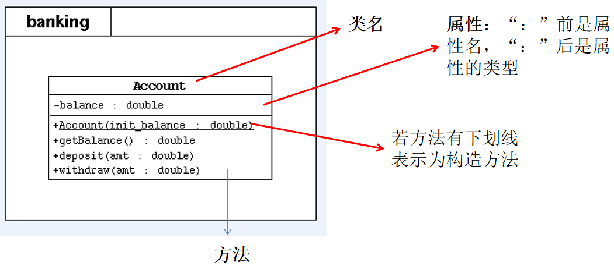
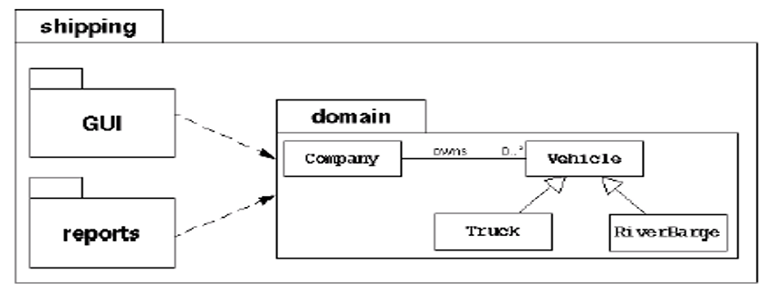

day07
==

# 关键字--this
## this作用
* 在java中，this的作用和其词义相近。
    * 它在方法内部使用，即这个方法所属对象的引用
    * 它在构造器内部使用，表示该构造器正在初始化的对象
* this表示当前对象，可以调用类的属性、方法和构造器
* 什么时候用this关键字
    * 当在方法内需要调用该方法的对象时，就用this
    
* 使用this调用属性、方法
this理解为当前对象或当前正在创建的对象
```java
class Person {
    private String name;
    private int age;
    
    // 构造器
    public Person(String name, int age) {
        this.name = name;
        this.age = age;
    }
    
    // 方法
    public void getInfo() {
        System.out.println("姓名: " + name);
        this.speak();
    }
    
    public void speak() {
        System.out.println("年龄: " + this.age);
    }
    
}

```

* 使用this调用本类的构造器
>this可以作为一个类中，构造器相互调用的特殊格式
```java
class Person {
    private String name;
    private int age;
    
    // 构造器
    public Person() { // 构造器1，无参构造器
        System.out.println("新对象实例化");
    }
    
    public Person(String name) { // 构造器2
        this(); // 调用本类中的构造器1（无参构造器）
        this.name = name;
    }
    
    public Person(String name, int age) {
        this(name); // 调用 构造器2
        this.age = age;
    }
    
    // 方法
    public String getInfo() {
        return "姓名: " + this.name + ", 年龄: " + age;
    }
}

```

* this可表示正在操作本方法的对象，即当前对象
```java
class Person {
    String name;
    
    // 构造器
    Person(String name) {
        this.name = name;
    }
    
   // 方法
   public void getInfo() {
        System.out.println("Person类==>" + this.name);
   }
   
   public boolean compare(Person p) {
        return this.name = p.name;
   }
   
}

public class TestPerson {
    public static void main(String[] args) {
        Person p1 = new Person("张三");
        Person p2 = new Person("李四");
        p1.getInfo();
        p2.getInfo();
        boolean bool = p1.compare(p2);
    }
}


```

## this关键字使用注意事项
* 使用this(形参)必须放在构造器的首行
* 使用this调用本类中其他的构造器，保证至少有一个构造器不是使用this，避免形成死循环

# JavaBean
* JavaBean是一种java语言写成的可重用组件
* 所谓JavaBean，是指符合如下标准的java类
    * 类是公共的(public)
    * 有一个无参的公共构造器
    * 有属性，且有对应的get、set方法
* 用户可以使用JavaBean将功能、处理、值、数据库访问和其他任何可以用java代码创造的对象
进行打包，并且其他的开发者可以通过内部的JSP页面、Servlet、其他JavaBean、applet程序或者
应用来使用这些对象。用户可以认为JavaBean提供了一种随时随地的复制和粘贴的功能，而不用关心
任何改变。

* JavaBean示例
```java
public class TestJavaBean { // 类访问权限为public
    private String name; // 属性 权限修饰符一般为private
    private int age;
    
    // 无参public构造器
    public TestJavaBean() {
        
    }
    
    // 方法(get、set方法)
    public void setName(String name) {
        this.name = name;
    }
    
    public String getName() {
        return name;
    }
    
    public void setAge(int age) {
        this.age = age;
    }
    
    public int getAge() {
        return age;
    }
    
}

```

## UML类图


* 权限表示
    * \+ 表示public
    * \- 表示private
    * \# 表示 protected
* 方法的写法
>方法类型(+、-) 方法名(参数名: 参数类型): 返回值类型

# 关键字--package
package软件包作用
* 包帮助管理大型软件系统：将主义相近的类组织到包中；解决类命名冲突问题
* 包可以包含类和子包
* 例：某航运软件系统包括：一组域对象、GUI和reports子系统


## package的使用
* package语句作为java源文件的第一个语句，指明该文件中定义的类所在的包。
(叵缺省该语句，则指定为无名包)。

* 语法格式为:
>package 顶层包名.子包名;

```java
// pack/Test.java
package pack; // 指定类Test属于包pack

public class Test {
    public void display() {
        System.out.println("in method display()");
    }
}

```
* 包对应文件系统的目录，package语句中，用"."来指明包(目录)的层次
* 包通常用小写单词，类名首字母通常大写
  
    
# 关键字--import
import作用：import语句告诉编译器到哪里去寻找类

* 为使用定义在不同包的java类，需要import语句来引入指定包层次下所需要的类或全部类(.*)
* 语法格式
>import 包名[.子包名...].<类名 |*>

* 应用举例
```java
import pack.Test; // import pack.*; 表示引入pack包中所有的类
public class TestPackage {
    public static void main(String[] args){
        Test t = new Test();
        t.display();
    }
}

```
* 目前不支持 import ... as 语法

## import语句使用注意事项
* 若引入的包为:java.lang,则编译器默认可获取此包下的类，不需要再显式声明。
* import语句出现在package语句之后，类定义之前
* 一个源文件可包含多个import语句
* 可以使用import lee.*;语句，表明导入lee包下的所有类，而lee包下sub子包内的类则不会被 导入。
若要导入sub下的类:import lee.sub.*;
* import 语句还是必须的，可在类里使用类的命名。如java.util.Scanner
* JDK 1.5加入import static语句
>import static 表示导入指定类的static的属性或方法
* 不支持多个.*.*，如import java.util.*.*，这个是不支持

# JDK主要的包介绍
1. java.lang
>包含一些java语言的核心类，如String、Math、Integer、System、Thread，常用功能
* java.net
>包含执行与网络相关操作的类和接口
* java.io
>包括能提供多种输入/输出功能的类
* java.util
>包含一些实用工具类，如定义系统特性、接口的集合框架类、与日期日历相关的函数
* java.text
>包含了一些java格式化相关的类
* java.sql
>包含了java进行JDBC数据库编程相关的类/接口
* java.awt
>包含了构成抽象窗口工具集(abstract windows toolkits)的类，这些类被用来构建和管理
应用程序的图形用户界面(GUI)
* java.applet
>包含applet运行所需的类

# 面向对象特征之二：继承

## 继承基本概念
* 为什么要有继承
    * 多个类中存在相同属性和行为时，将这些内容抽取到单独的一个类中，那么其他多个类就不
需要再定义这些属性和行为，只要继承那个类即可

* 此处的多个类成为"之类"，单独的这个类称为"父类"(基类或超类)
* 继承语法格式
>class Subclass extends Superclass { }  
可以理解为：Subclass 扩展于 Superclass

## 继承的作用
* 继承提高了代码的复用性
* 继承让类于类之间产生了关系，提供了多态的前提

使用注意事项
* 不要仅为了获取其他类中某个 功能而去继承
* 子类继承了父类的方法和属性(两者都包括priavte的，只是不能直接调用)。
* 在子类中，可以使用父类中定义的方法和属性，也可以创建新的属性和方法
* java中，继承的关键字是"extends"，子类不是父类的子集，而是父类的扩展

## 继承的规则
* 子类不能直接访问父类中私有的(private修饰)的属性和方法
* java继承只支持单继承（即一次只能继承一个父类），不允许多重继承，但允许多层继承
    * 一个子类只能有一个父类
    * 一根父类可以派生出多个子类
* 类的构造器不能被继承，因为构造器名要与类名相同
* 当父类定义了public 构造器时，必须在子类中重新定义构造器，不再提供默认的构造器了。
当父类的构造器为缺省的权限修饰符或没写，则子类中依然有默认的构造器


# 方法的重写（overrides）
## 定义
在子类中可以根据需要对从父类继承来的方法进行重新写过，也称方法的覆盖、重置。
在程序执行时，子类的方法将覆盖父类的方法

## 方法重写规则
注意的要素： 修饰符 返回值类型 方法名(参数列表) { }
* 子类重写方法必须和父类被重写方法具有相同的 方法名、参数列表、返回值类型。
* 子类重写方法修饰符权限不能比父类被重写方法访问权限小，可以更大，至少也要相等(修饰符权限不能小,可以理解为继承的开放性)
* 子类重写和父类被重写的方法必须同时为static的或同时为非static的类型
* 子类重写方法抛出的异常类型不能大于父类被重写方法的异常类型
* 如果父类中一个方法 private myMethod() { },子类中写了一个 myMethod() { } 或public myMethod() { }，
那么这两种情况都不叫重写!!!。因为父类的方法在子类中不见。

* 建议在子类中重写方法时，直接从父类中把类第一行复制过来，再被上}。
>public void showInfo() {


多层继承


## 方法重写与方法重载的区别
* 方法重载  
两同一不同 
    * 同一个类
    * 同一个方法名
    * 不同的参数列表
    * 方法的重载与方法返回值无关
    * 构造器可以重载
* 重写
    * 前提在继承的基础之上，子类在获取父类的结构之后，可以对父类中同名的方法进行“重构”
    * 方法的返回值、方法名、形参列表相同
    * 权限修饰符不小于父类同名方法
    * 重写的方法异常类型不大于父类的
    * 两个方法要同为static或非static
    


