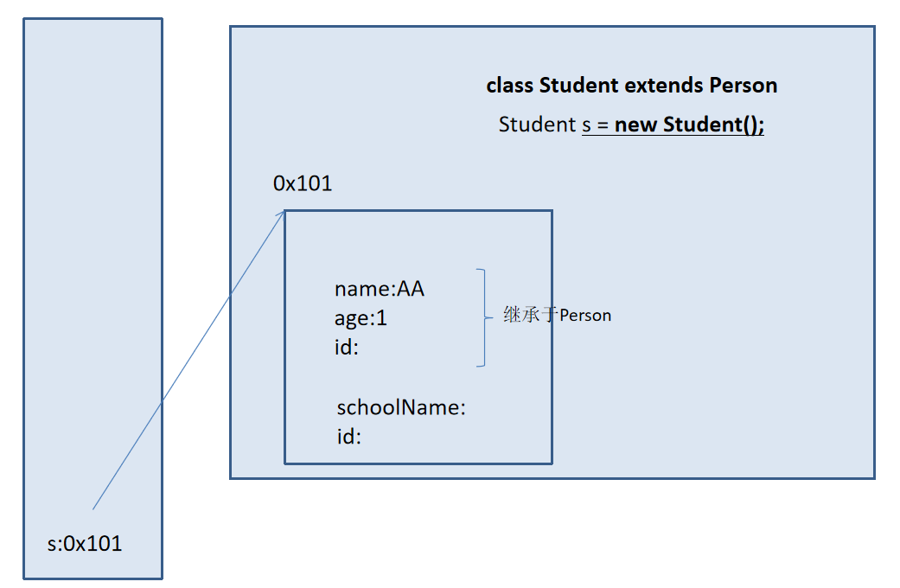
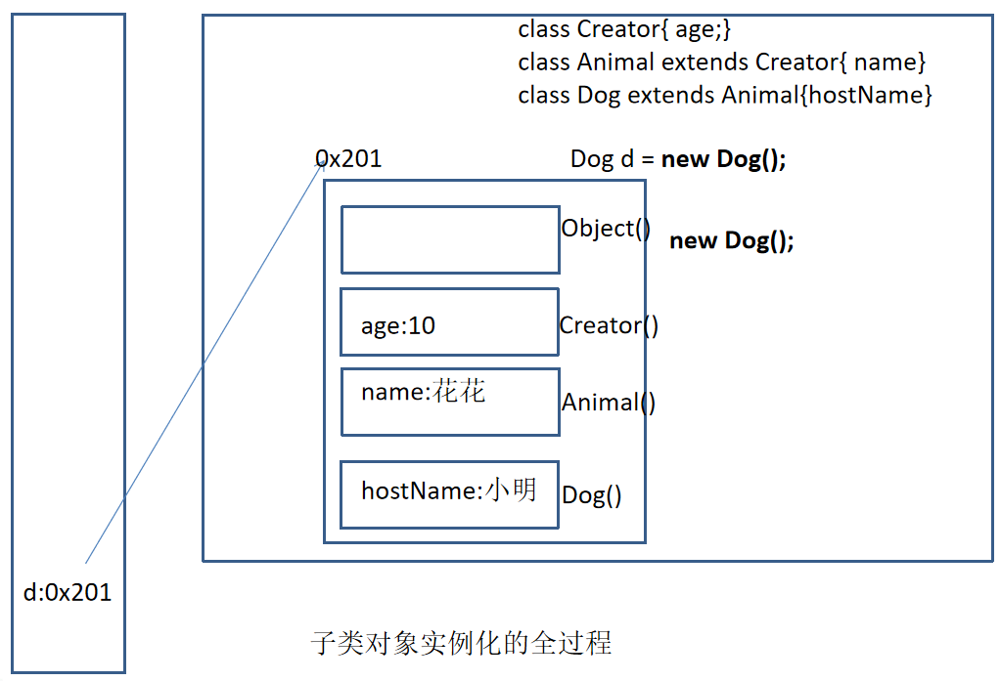

day08
==

# 四种访问权限修饰符
java权限修饰符private、缺省(不写)、protected、public置于类成员前面，用来限定对象对该
类对象成员的访问权限。

修饰符 |类内部 |同一个包 |子类 |任何地方 | 可修饰的成员
:---|--- |--- |--- |--- |--- 
private |yes | | | |属性、方法、构造器
default(缺省,不写)|yes |yes | | |属性、方法、构造器、  类
protected|yes |yes |yes | |属性、方法、构造器
public |yes |yes |yes |yes |属性、方法、构造器、  类

* 可以修饰class(类)的只有public、default
* public类可以在任何地方被访问
* default类只能被同一个包内部的类访问

# super关键字
super: 可以用来修饰属性、方法、构造器
* 当子类与父类中有相同的属性时，可以通过"super.属性" 显示的调用父类中声明的属性，
  若想调用子类的同名属性"this.属性" 或直接调用 属性
* 当子类重写了父类的方法后，在子类中需要调用父类中被重写的方法，使用"super.方法名"
* 构造器中使用super()
    * 在子类中使用"super(形参列表)" 显式的调用父类中指定的构造器
    * 构造器内，super(形参列表) 必须写在首行
    * 同一个构造器，"super(形参列表)" 或 "this(形参列表)" 只能出现一个！！！
    * 构造器中，不显式的调用"this(形参列表)" 或 "super(形参列表)"，默认调用的时父类空参的构造器，即super();
    * 建议设计一个类时，尽量要提供一个空参的构造器！

* 注意
    * 当子父类出现同名成员时，可以使用super进行区别
    * super可追溯到Object根类
    * super和this的用法相像，this表示本类对象的引用，  
    super表示父类内存空间的表示
    
## 调用父类的构造器
* 子类中所有的构造器默认都会访问父类中的空参构造器
* 当父类中没有空参的构造时，子类的构造其必须通过this(形参列表) 或 super(形参列表)语句指定调用
本类或父类中相应的构造其，且必须放在构造其的第一行
* 如果子类构造其中没有显示调用父类或本类的构造器，并且父类中也没有无参的构造器，则编译出错

# this 和 super的区别
区别 |this |super
:--- | --- |---
访问属性|访问本类中的属性，如果本类中没有此属性则从父类中继续查找 |访问父类中的属性(可继续找到跟类)
调用方法 |访问本类中的方法 | 直接访问父类中的方法
调用构造器 |调用本类构造器，必须放在构造器的首行| 调用父类构造器，必须放在子类构造器的首行
特殊 |表示当前对象 |无此概念 

super

子类对象实例化的过程

