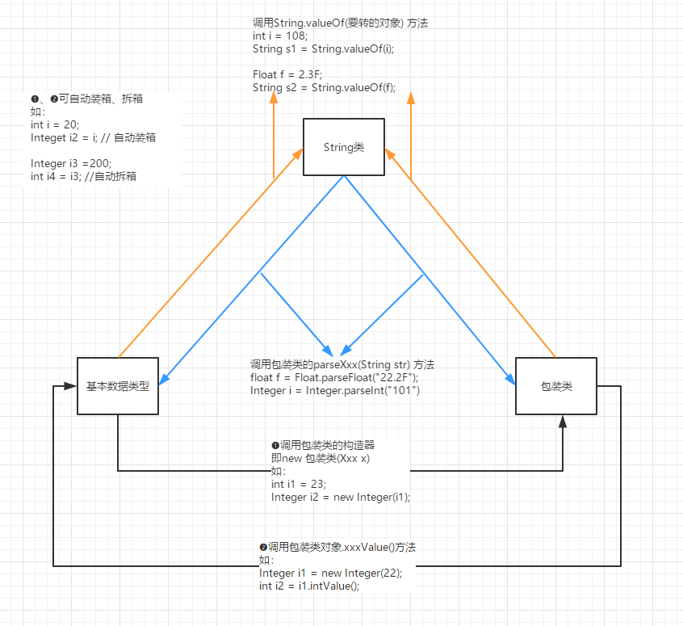

day09
==

# toString() 方法
* toString()方法在Object类中定义，其返回值是String类型，返回类名和它的引用地址
* 在进行String与其他类型数据的连接操作时，自动调用toString()方法
```java
    Date now = new Date();
    System.out.println("now = " + now);
    System.out.println("now = " + now.toString()); 
```
* 可以根据需要在用户自定义的类中重写toString()方法
```java
// 如String类重写了toString()方法，返回字符串的值
s1 = "hello";
System.out.println(s1); // 相当于System.out.println(s1.toString());

```
* 基本数据类型转换为String类型时，调用了对应包装类的toString()方法
    >int a = 10;  
    System.out.println("a = " + a);
    
* String, 包装类, File, Date等类默认就已经重写了toString()方法


    
# 包装类(Wrapper)
* 针对8种基本定义相应的引用类型（包装类，或叫封装类）
* 有了类的特点，就可以调用类中的方法

基本数据类型 |包装类 |备注
:--- |--- |---
boolean |Boolean |
byte |Byte |
short |Short |
int |Integer |
long |Long |
char |Character
float |Float |
double |Double |


* 基本数据类型包装成包装类，叫做 装箱
    *  通过包装类的构造器实现
    ```java
    int i = 500;
    Integer t = new Integer(i);
  
    ````
    * 通过字符串参数构造器包装类对象
    ```java
    Float f = new Float("4.56");
    Float f2 = new Float(3.14);
    Long l = new Long("abc") // 编译时报NumberFormatException
  
    Boolean b1 = new Boolean("true"); // true
    System.out.println(b1);
    Boolean b2 = new Boolean(false);
    System.out.println(b2);
    Boolean b3 = new Boolean("true100"); // false，只要写的不是true，则都是false,能正常编译和运行
    System.out.println(b3);
    ```
* 获得包装类对象中包装的基本类型变量，叫做 拆箱
    * 调用包装类对象的.xxValue()方法
    ```java
    Boolean obj = new Boolean(true);
    boolean b = obj.booleanValue();
    ```
* JDK 1.5之后，支持自动装箱，自动拆箱。但类型必须匹配
```java
        // JDK 1.5后，自动装箱、拆箱
        int i61 = 18;
        Integer i62 = i61; // 自动装箱
        System.out.println(i62.toString());
        Boolean b63 = false;

        Integer i66 = new Integer(15);
        int i67 = i66; // 自动拆箱
        System.out.println(i66);
```

* 字符串转换成基本数据类型
    * 通过包装类的构造器实现
    ```java
    int i = new Integer("12");
    ```
    * 通过包装类的parseXx(String s)静态方法
    ```java
    Float f = Float.parseFloat("12.1");
    ```
* 基本数据类型转换成字符串
    * 调用String类重载的valueOf()方法
    ```java
    String ftr = String.valueOf(2.34F);
    ```
    * 字符串拼接的方式
    String intString = 5 + "";
    
* 包装类的实际开发中用的最多是将字符串转变为 基本数据类型
```java
String str1 = "30";
String str2 = "30.3";

int x Integer.parseInt(str1); // 将字符串转变为int型
float f = Float.parseFloat(str2); // 将字符串转变为float型

```

## 基本数据类型、包装类、String类三者之间的互转


