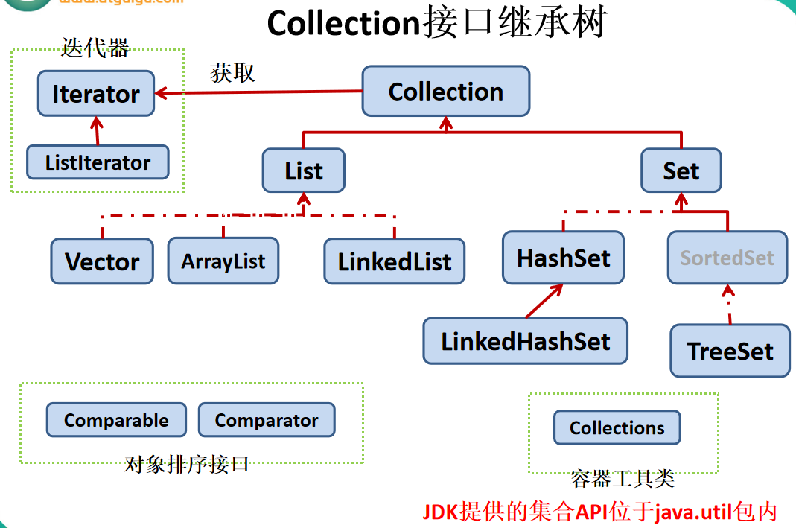

day12 异常处理
==

# 第二种异常处理方式：声明抛出异常
在方法的声明处，显式的抛出该异常对象的类型

* 如果一个方法中(包括编译、运行时)肯能出现某种异常，  
但是并不能确定如何处理这种异常，则此方法应显式的声明抛出异常，  
表明该方法将不对这些异常进行处理，而由该方法的调用者负责处理

* 在方法中声明用throws语句可以声明抛出异常的列表，  
throws的异常列表可以是方法中产生的异常类型，也可以是它的父类

* 格式：public void readFile() throws FileNotFoundException, IOException { }
* 当在此方法内部出现异常时，会抛出一个异常类的对象，抛给方法的调用者
* 异常对象可以逐层向上抛，一直到main方法中。在向上抛的时候，可以用try-catch-finally进行处理
* main()方法中抛出异常时到JVM中

示例
[Throws Exception](./src/com/java/www/ThrowsException.java)


## 重写方法声明抛出异常的原则
* 重写方法不能抛出比被重写方法范围更大的异常类型。  
在多态的情况下，对method()方法的调用时异常的捕获按照父类声明的异常处理

示例
[Throws Override 原则](./src/com/java/www/ThrowsOverrideTest.java)


# 手动抛出异常
* Java异常类对象除在程序执行过程中出现异常时由系统自动生成并抛出，也可根据需要人工创建并抛出。
    * 首先要生成异常类的对象，让后通过throw语句抛出异常对象
    >IOException e = new IOException();
    throw e;
    
    * 抛出的异常对象必须是Throwable或其子类的实例
    
java异常处理模型：抓抛模型
* 抓
    * try-catch-finally
    * throws 异常的类型列表  （在方法声明处，{ }前）
* 抛
    * 自动抛出
    * 手动抛出：throw 异常类的实例

[手动抛出异常](./src/com/java/www/ThrowTest.java)    


# 创建用户自定义的异常类
* 一般的，用户定义的异常类都是RuntimeException的子类
* 通常要编写几个重载的构造器
* 同样可以通过throw抛出自定义异常类的对象
* 自定义异常最重要的是异常类的名字，当异常出现时，可以根据名字判断异常类型

```java
class MyException extends Exception {
   	static final long serialVersionUID = 1L;
	private int idnumber;
 	public MyException(String message, int id) {
		super(message);
		this.idnumber = id;
 	} 
	public int getId() {
		return idnumber;
 	}
}

```

[自定义的异常类](./src/com/java/exercise/EcmDef.java)

## 异常处理5个关键字
抓
* try - catch - finally
* throws 异常类型列表  （方法声明处声明异常）

抛
* 自动
* thow 异常实例  （异常处）


# java集合
本章内容
* java集合框架
* Collection接口API
* Iterator接口API
* Collection子接口之一：List接口
    * HashSet
    * LinkedList
    * Vector
    
* Collection子接口之二：Set接口
* Map接口
    * HashMap
    * TreeMap
    * Hashtable

* Collection工具类

## java集合概述
* 一方面，面向对象语言对事物的体现都是以对象的形式，为了方便对多个对象的操作，就要对对象进行存储。  
另一方面，使用Array数组存储对方具有一些弊端，二java集合就像一种容器，可以动态的把多个对象的引用放入容器中。

* java集合类可以用于数量不等的多个对象，还可以用于保存具有映射关系的关联数组。
* java集合分为Collection和Map两种体系
    * Collection接口
        - Set：元素无序、不可重复的集合
        - List：元素有序，可以重复 -- 动态数组
    * Map接口：具有映射关系"key-value"对的集合
    

## Collection几口继承树


+ Collection
    - 方法iterator()
        返回对象类型为Iterator
            ListIterator
    
    - 实现接口子类
        * List 元素有序（遍历顺序为添加顺序），可重复
            * ArrayList 元素在内存中连续存储，  
                        读取性能好，  
                        线程不安全
            * LinkedList 元素在内存中不连续，通过链表维护元素的插入顺序，  
                            写删性能好，  
                            读取性能不错，线程不安全
            * Vector 线程安全，使用方法大体与ArrayList相同，效率低，不建议使用
        * Set 元素无序，不可重复
            * HashSet 元素对象的hashCode()值决定改元素存储的位置，遍历顺序与插入顺序不同，  
                        判断两个对象是否相同：先通过元素对象的hashCode是否想等、不等不相同，若hashCode值相等，再通过equals比较  
                        线程不安全，
                * LinkedHashSet 使用链表维护元素插入顺序，遍历顺序为插入顺序。  
                                元素存储位置、比较两个元素是否相同的方法同HashSet，  
                                线程不安全
            * SortedSet 
                * TreeSet 元素必须为同一个类的，自然排序：有对象的int compareTo(Object o)决定；  
                            定制排序：创建一个实现了Comparator接口的对象,重写int compare(Object o1, Object o2)方法，把该对象传入TreeSet构造器；  
                            比较两个元素是否相同的方法同HashSet，   
                            线程不安全

* 集合API都位于java.util包内
  
* 对象排序接口
    * Comparable
    * Comparator
    
## Map接口继承树


+ Map key-value键值对，或叫entry，key不能重复，value可以重复  
    Set keySet();  
    Collection values();  
    Set entrySet();
    
    - HashMap entry顺序由key的int hashCode()决定，遍历顺序与插入顺序不同，与存储顺序相同，  
                    
        * LinkedHaspMap 使用链表维护entry插入顺序，遍历顺序为entry插入顺序。
    - Hashtable 线程安全，比较老
        * Properties 处理属性文件
    - SortedMap
        * TreeMap key必须为同一个类的，  
                    entry存储顺序由Set keySet()决定，同与TreeSet。其实TreeSet可用看成所有value为空的特殊TreeMap

## Collection接口
* Collection是List、Set、Queue接口的父类，该接口定义的方法可以操作List、Set、Queue集合
* 该接口不提供任何实现，有具体的子接口实现
* java 5之前，java集合会丢失所有对象的数据类型，把所有对象当成Object类型处理；  
从java 5增加了泛型，java集合可以记住集合中对象的数据类型

## Collection接口方法
* int size() 返回集合中元素的个数
* boolean add(E e) 向集合中添加一个元素
* boolean addAll(Collection coll) 将一个集合所有元素添加到当前集合中
* 查看所有元素 System.out.println(Collection实例);
* boolean isEmpty() 判断集合是否为空，是返回true，否则false
* void clear() 清空合集所有元素
* boolean contains(Object obj) 判断集合中是否包含指定的元素obj，如果包含返回true，否则false。
>判断方法：用到了类中的equals(Object o)方法。若使用了自定义类要重写equals()方法
* boolean containsAll(Collection coll) 判断当前集合是否包含coll集合中所有的元素。即判断一个集合是否为当前集合的子集
* boolean retainAll(Collectoin coll) 当前集合中仅保留一个集合coll与当前集合的交集给当前集合，会覆盖当前集合
* boolean remove(Object obj) 删除集合中的obj元素。若删除成功返回true,否则返回false
* booeanl removeAll(Collection coll) 从当前集合中删除与另外一个集合coll的交集所有元素。即 当前集合 - coll集合的差集。
* boolean equals(Object obj) 判断一个集合obj与当前集合两者所有的元素是否都相等。
* int hashCode() 获取当前集合的hash值
* Object[] toArray() 将集合转化成数组
* Iterator<E> iterator() 返回一个Iterator接口实现类对象，可用于遍历集合。该方法返回的对象类型为Iterator，有boolean hasNext()、Object next()方法


实例  
[Collection Test](./src/com/java/collection/CollectionTest.java)


## 使用Iterator接口遍历集合元素
* Iterator对象称为迭代器（设计模式的一种），主要用于遍历Collection集合元素
* 所有实现了Collection接口的集合类都有一个iterator()方法，用以返回一个实现了Iterator接口的对象，该对象有boolean hasNext()，E next()、void remove()方法，E格式泛型
* Iterator仅用于遍历集合，Iterator本身并没有提供承装对象的能力。如果需要创建Iterator对象，
必须有一个别迭代的集合

示例  
[用Iterator对象遍历集合](./src/com/java/collection/SetErgodic.java)

## Iterator接口方法

方法|方法描述
:---|---
boolean hasNext() |iteration迭代器中还有元素则返回true,否则false
E next() |返回iteration迭代器中的下一个元素
void remove() |从集合中移除迭代器返回的最后一个元素（可选操作）

* 在调用it.next()方法之前必须要调用it.hasNext()进行检测。若不调用，且下一条记录无效，直接调用it.next()会抛出NoSuchElementException异常

## for增强版遍历集合元素-- foreach
* java 5提供了foreach迭代访问集合，同时也可用遍历数组
示例
[遍历集合](./src/com/java/collection/CollectionErgodic.java)


## List接口
* 用数组存储数据有局限性，数组长度不可变，存放数据个数不确定
* List集合类中元素 有序、不可重复，集合中的每个 元素都有一个对应的顺序索引
* List容器中的元素都有一个整数的索引记录在容器中的位置，可根据索引获取该元素
* JDK API中List接口的实现类常用的有：ArrayList、LinkedList、Vector

* 在集合Collection类的基础上添加下面的方法
    * Object get(int index) // 获取指定下标元素
    * void add(int index, Object ele) // 指定下标插入一个元素
    * boolean addAll(int index, Collection eles) // 把一个集合所有元素插入指定下标处
    * Object remove(int index) // 移除指定下标的元素
    * Object set(int index, Object ele) // 重置指定下标元素值(更新)
    * int indexOf(Object obj) // 给定对象首次出现的下标位置，没有则返回 -1
    * int lastIndexOf(Object obj) // 给定对象最后一次出现的下标位置，没有则返回 -1
    * List subList(int fromIndex, int toIndex) // List切片处理，截取[开始下标，结束下标)为新的List，注意是左闭右开，相当于取一个子集

示例  
[List接口方法测试](./src/com/java/collection/ListTest.java)

## List接口实现类之一：ArrayList
* ArrayList时List接口的典型事项类
* ArrayList本质上是对象引用的一个边长数组
* ArrayList时线程不安全的，Vector时线程安全的（不推荐使用，效率低）
* Arrays.asList(Object...) 方法返回的List集合既不是ArrayList实例也不是Vector实例。  
Arrays.asList(Object...) 返回值是一个固定长度的List集合
