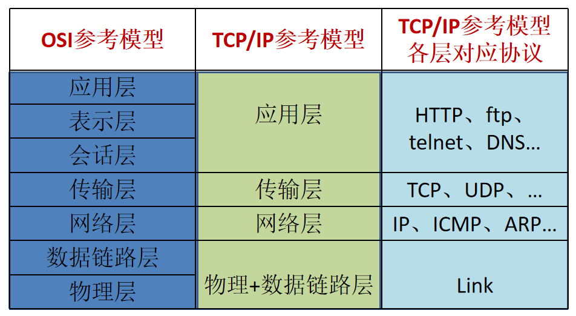

day20_网络编程
==

# 主要内容
* 网络编程概述
* 通讯要素
    * IP和端口
    * 网络通信协议
* InetAddress类
* TCP socket网络编程
* UDP socket网络编程
* URL socket网络编程


# 网络编程概述
* Java提供的网络类库，可以实现无痛的网络连接，联网的底层细节被隐藏在 Java 的本机安装系统里，由 JVM 进行控制。
并且 Java 实现了一个跨平台的网络库，程序员面对的是一个统一的网络编程环境。

# 网络基础
* 计算机网络
```text
把分布在不同地理区域的计算机与专门的外部设备用通信线路互连成一个规模大、功能强的网络系统，
从而使众多的计算机可以方便地互相传递信息、共享硬件、软件、数据信息等资源。

```

* 网络编程的目的
>直接或间接地通过网络协议与其他计算机进行通讯

* 网络编程中主要的两个问题
    * 如何准确地定位网络上的一台或多台主机
    * 找到主机后如何可靠高效地进行数据传输

* 实现网络中主机互相通信的机制
    * 通信双方地池
    * 一定的规则(主要有两套参考模型)
        * OSI 7层参考模型：模型过于理想或，未能在互联网上进行广泛推广
        * TCP/IP 4层参考模型：事实上的国际标准

* 通信要素:网络通信协议
   
    
* 通信要素:IP和端口
* IP地址：InetAddress
    * 唯一的标识Internet上的计算机
    * 本地回环地址：127.0.0.1,主机名：localhost
    * 不易记忆
* 端口：标识正在计算机上运行的进程(程序)
    * 不同的进程有不同的端口
    * 被规定为一个16二进制整数，端口可使用范围：(0-65535]
* IP与端口的组合得出一个socket


# InetAddress类
* 主机地址的两种表示形式
    * 域名(hostName)，如：www.baidu.com
    * IP地址(hostAddress)，如：223.5.5.5
* InetAddress类主表示IP地址  
两个子类
    * Inet4Address
    * Inet6Address
* InetAddress对象含有一个Internet主机的域名和IP地址
* 域名易于记忆，通信前需要把域名解析成IP地址

## 构造器
// 跨包后调用不了此构造器
protected InetAddress() {
        holder = new InetAddressHolder();
}

## 方法
* 创建InetAddress对象
static InetAddress getByName(String host)
static InetAddress getByAddress(byte[] addr)
static InetAddress getByAddress(String host, byte[] addr)
static InetAddress[] getAllByName(String host) 获取到域名解析出来的多个IP

* 获取相关属性
String getHostName()
String getHostAddress()
byte[] getAddress()
String getCanonicalHostName()
static InetAddress getLocalHost()
static InetAddress getLoopbackAddress()

[InetAddress使用示例 ](./src/com/java/www/InetAddressTest.java)  


# 通信要素2：网络通讯协议
* 通信协议
```text
计算机网络中实现通信必须有一些约定，
即通信协议，对速率、传输代码、代码结构、传输控制步骤、出错控制等制定标准。

```

* 通信协议分层思想
```text
由于结点之间联系很复杂，在制定协议时，把复杂成份分解成一些简单的成份，再将它们复合起来。
最常用的复合方式是层次方式，
即同层间可以通信、上一层可以调用下一层，
而与再下一层不发生关系。
各层互不影响，利于系统的开发和扩展。
```

## TCP/IP协议簇
* 传输协议中两个重要的协议
    * TCP(Transmission Control Protocol) 传输控制协议
    * UDP(User Datagram Protocol) 用户数据报协议

* TCP/IP 以其两个主要协议
>传输控制协议(TCP)和网络互联协议(IP)而得名，  
实际上是一组协议，包括多个具有不同功能且互为关联的协议。  

* IP(Internet Protocol)协议是网络层的主要协议，支持网间互连的数据通信
* 


    

# 其他
## java lambda表达式
符号：() -> {}
即一个匿名类的匿名方法

```text
// 如： 
Runnable runnable = () -> {
    // 方法内容
    ...
}
```

## InputStream判断数据已经读取结束的解决方法
* 让发送端发送完数据后，关闭连接。 这个在Http的操作时很常见。
* 约定发送的数据长度，比如 http的 keepAlive 就是必须依赖这个的 Content-Length 
* 设置超时的时间，根据我的经验，只有在Socket级别设置才有效. 
Socket socket = new Socket(host,port); 
socket.setSoTimeout(100); // 如果超过100毫秒还没有数据，则抛出 SocketTimeoutException


