java 9新特性
==

# 新特性概览
```text
java 9 发布于2017-9-21
java 9 提供了超过150项新功能特性，
包括备受期待的模块化系统、
可交互的 REPL 工具：jshell，
JDK 编译工具，
Java 公共 API 和私有代码，
以及安全增强、扩展提升、性能管理改善等。
可以说 Java 9 是一个庞大的系统工程，完全做了一个整体改变
```

## 本章内容
* 模块华系统
* jShell命令
* 多版本兼容jar包
* 接口的私有化方法
* 钻石操作符(<>箭头操作符)的使用升级
* 语法改进:try语句
* 下划线使用限制
* String存储结构变更
* 便利的集合特性:of()
* 增强的Stream API
* 多分辨率图API
* 全新的HTTP客户端API
* Deparated的相关API
* 智能java编译工具
* 统一的JVM日志系统
* javadoc的HTML5支持
* javascript引擎升级:Nashorn
* java的动态编译器

# JDK和JRE的改变
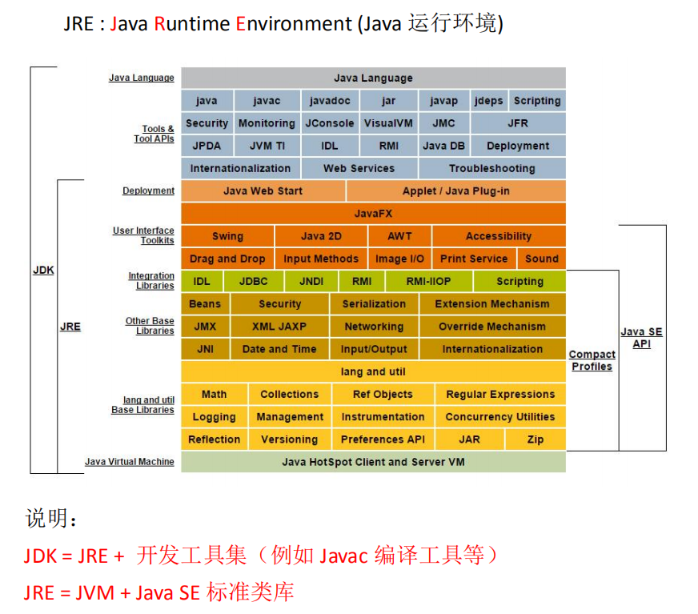  

## jdk9目录结构
[JDK9目录结构](images/JDK9目录结构.png)

```text
没有jre子目录了
bin: 包含所有命令。在windows平台上，它继续包含了系统的运行时动态链接库
conf: 包含用户可编辑的配置文件，例如以前位于jre/lib目录中的.properties和.policy文件
include: 包含编译本地代码使用的C/C+=头文件。它只存在于JDK中
jmods: 包含JMOD格式的平台模块。创建自定义运行时映像时需要它。它只存在于JDK中
legal: 包含法律声明
lib: 包含非windows平台上的动态链接本地库。其子目录和文件不应由开发员直接编辑或使用

```

# 模块化系统
Jigsaw项目后改名为Modularity，目的让java模块独立、化繁为简
模块化，使代码组织上更安全，因为它可以指定哪些部分可以暴露，其他部分隐藏

* 模块(module)，本质就是在package外在包一层

## 模块使用示例
<details>
<summary>模块使用示例</summary>

* 需求
```text
如下图：模块结构
module有：core、main、pages
把core模块下的包com.java.www 暴露给外部调用，
测试，模块pages中能访问到core模块下的包com.java.www下的Person类
```
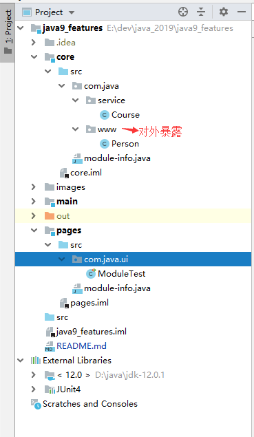  

* 新建多个不同的模块  
**默认情况下，每个模块都只能访问到本模块下的类、接口等，无法跨模块去访问**  
  

* 在每个模块下创建module-info.java文件
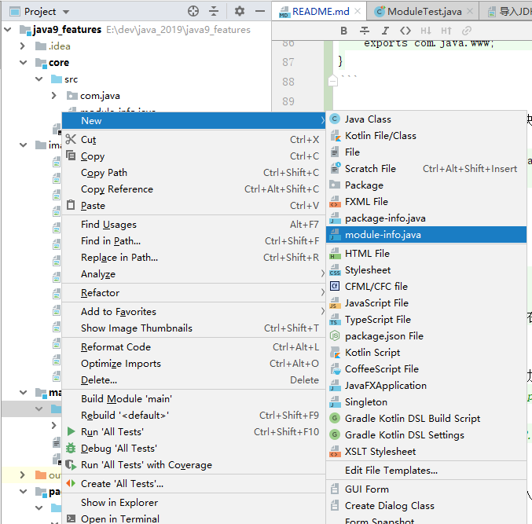  

* 设置模块core下的com.java.www包导出
```text
编辑模块core的src目录下的module-info.java文件，添加如下内容：
    exports com.java.www;
具体如下
```

```text
module core {
    // 导出包
    exports com.java.www;
}
```

* 设置模块pages中导入需要的模块
```text
编辑模块pages的src目录下的module-info.java文件，添加如下内容：
    requires core;
具体如下
```

```text
module pages {
    // 导入模块
    requires core; // 光标放这在这行，Alt + Enter键，选择Add dependency on module 'xxx'
}
```
注意添加了这行内容后，要执行添加依赖模块操作，执行后的变化
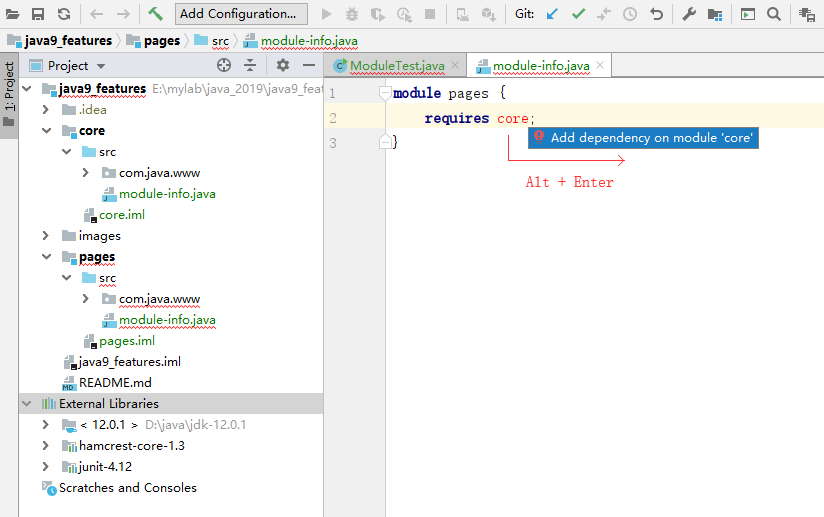  

  


* 注意:本模块中的包名不能与导入的包名不能相同
* 测试
[ModuleTest](./pages/src/com/java/ui/ModuleTest.java)
</details>

## 在模块中导入JKD内部的模块
  

此时在相应的module-info.java文件中自动添加了配置
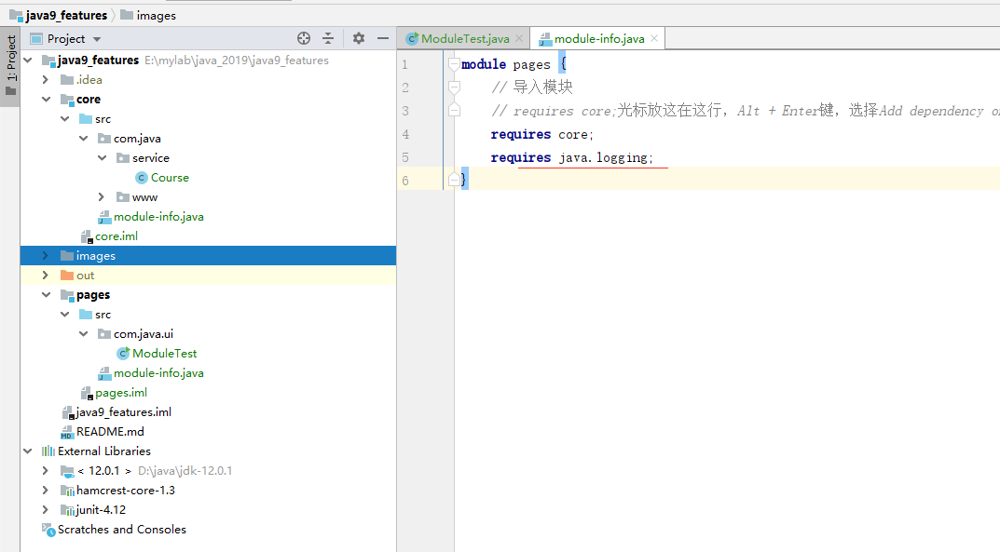  

## 模块中导入jUnit模块
<details>
<summary>模块中导入jUnit模块</summary>

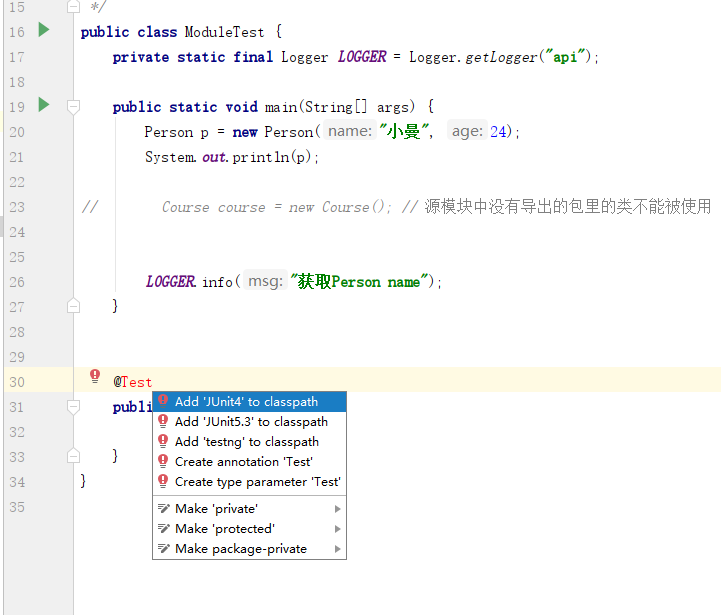  
  
  
  
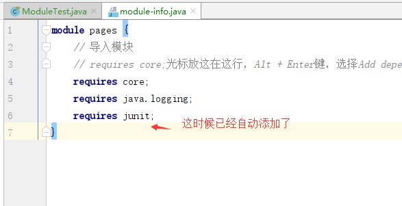  
  

</details>

# REPL工具:jShell
REPL：read-evaluate-print-loop.
jShell在命令行下就可以执行java命令和程序了

* tab自动补齐
* 自定添加分号

##  jShell使用示例
<details>
<summary>jShell使用示例</summary>

* 调出jShell
在cmd窗口执行 jshell
  

* /help 帮助
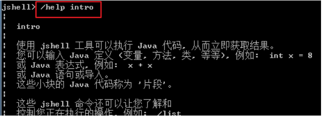  

* 基本使用
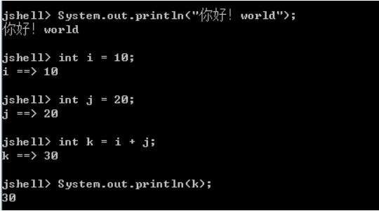  

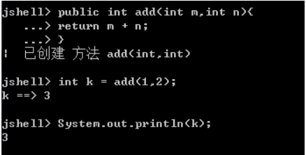  

* 导入指定的包
  

* /imports查看已导入的包
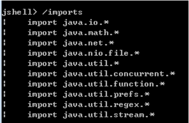  

* tab补齐代码
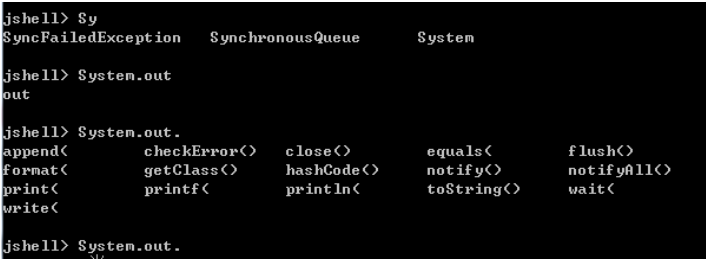  

* 列出当前会话里有效的代码片段
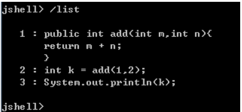  

* /var列出当前会话里创建了的变量
  

* /methods查看已创建的方法
  

* 加载并执行外部的源代码文件
  

* /edit使用pad文本编辑器
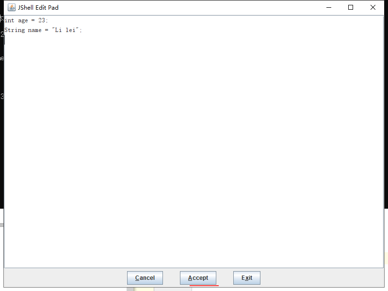  

* /exit退出jShell

</details>


# 多版本兼容jar包

1. 提供必要的类
```text
// 在指定目录(E:\teach\01_Java9\multijar\src\main\java\com\atguigu)下提供如下的类：

// Generator.java类
packagecom.atguigu;

import java.util.HashSet;
import java.util.Set;

public class Generator {
    // 构造器
    public Generator() {}

    // 方法
    public Set<String> createStrings() {
        Set<String> set = new HashSet<>();
        set.add("java");
        set.add("8");
        return set;
    }
}
```

```text
// 在如下目录(E:\teach\01_Java9\multijar\src\main\java-9\com\atguigu)下提供同名的类：

packagecom.atguigu;

import java.util.Set;

public class Generator {
    // 构造器
    public Generator() {}

    // 方法
    public Set<String> createStrings() {
        Set<String> set = Set.of("java", "9");
        return set;
    }
}
```

2. 打包
```text
javac -d build --release 8 src/main/java/com/atguigu/*.java

javac -d build9 --release 9 src/main/java-9/com/atguigu/*.java

jar --create --main-class=Application--filemultijar.jar -C build . --release 9 -C build9 .
```

3. 在java9及之前版本的环境下进行测试即可


# 接口的改进
可以声明私有方法

## 抽象类、接口异同
* 异
    * 二者的定义
    * 声明的方式
    * 内部的结构（java 7, java 8, java 9分别说明）
        ```
        java 7 接口只能定义常量、抽象方法
        java 8 接口中除了java 7特性外，还能定义default和static方法
        java 9 接口中除了 java7、java8特性外，还等定义private放啊
        ```
    * 抽象类单重继承，接口可以多重继续
* 同
>都不能实例化，以多态的方式使用

**示例**  
[MyInterface](./main/src/com/java/www/MyInterface.java)  
[MyInterfaceTest](./main/src/com/java/www/MyInterfaceTest.java)  

# 钻石操作符升级
```text
<>为钻石操作符

```

举例
```text
    public void test2() {
        Set<String> set = new HashSet<>(){ // 创建一个继续于HashSet的匿名内部类
            { // 这对{}为静态代码块
                add("GG");
                add("JJ");
                add("MM");
                add("DD");
            }
        };

        set.forEach(System.out::println);
    }
```
**示例**
[DiamondOperator](./main/src/com/java/www/DiamondOperator.java)  


# try语句的改进
主要是资源关闭的自动管理语法改进

**示例**  
[TryTest](./main/src/com/java/www/TryTest.java)  


# 下划线变量使用限制
* 在 java 8 中及之前的版本，标识符(变量)可以独立使用"_"来命名

* 在 java 9 中规定"_"不能单独命名标识符了，如果使用会报错

# String,StringBuffer,StringBuild存储结构变化
* java 9开始，String,StringBuffer,StringBuild再也不用 char[] 来存储啦，改成了byte[]加上编码标记，节约了一些空间

# 集合工厂方法：快速创建只读集合
* java 8及之前版本的写法
```text
    public void test1() {
        List<String> list = new ArrayList<>(){
            {
                add("tome");
                add("jarry");
                add("jampshon");
                add("dany");
            }
        };
        list.add("babery");
        // 创建一个只读集合
        List<String> list2 = Collections.unmodifiableList(list);
        list2.forEach(System.out::println);
//        list2.add("lisa"); // 报异常 java.lang.UnsupportedOperationException

    }
```
```text
    public void test2() {
        // 同样 创建一个只读集合。把一个可读写的集合转成只读集合
        List<Integer> list = Collections.unmodifiableList(Arrays.asList(22, 111, 33));
        Set<Integer> set = Collections.unmodifiableSet(new HashSet<>(Arrays.asList(11, 22, 33)));
        Map<String, Integer> map = Collections.unmodifiableMap(new HashMap<>(){
            {
                put("kk", 66);
                put("qq", 77);
                put("mm", 99);
            }
        });
        list.add(99);
        set.add(44);
        map.put("jj", 100);
    }
```

* java9创建只读集合写法
```text
/* 
List.of()
Set.of()
Map.of()
Map.ofEntries()
*/

    public void test3() {
        List<Integer> list = List.of(11, 33, 55);
        list.forEach(System.out::println);
//        list.add(66); // 报java.lang.UnsupportedOperationException 异常

        Set<Integer> set = Set.of(33, 22, 55, 66);
//        set.add(66); // 不可修改

        // 创建只读Map方式1
        Map<String, Integer> map = Map.of("k1", 33, "k2", 55, "k3", 99);
        map.forEach((k, v) -> System.out.println(k + ": "+ v));
        map.put("k5", 77); // 不可修改

        // 创建只读Map方式2
        Map<String, Integer> map1 = Map.ofEntries(Map.entry("k1", 33), Map.entry("k2", 66));
        map1.put("k3", 88); // 不可修改
    }
```

**示例**
[CollectionMapTest](./main/src/com/java/www/CollectionMapTest.java)


# 增强的Stream API
新增4个方法
* default Stream<T> takeWhile(Predicate<? super T> predicate)
>从此Stream对象由前往后去元素，当出现一个不符合predicate判断条件的停止取元素操作。

与  Stream<T> filter(Predicate<? super T> predicate) 是有区别的
* default Stream<T> dropWhile(Predicate<? super T> predicate)
 >从此Stream对象由前往后舍去元素，当出现一个不符合predicate判断条件的停止舍去元素操作  
 与takeWhile(Predicate predicate) 是互为反操作

* public static<T> Stream<T> ofNullable(T t)
>创建一个只能包含一个元素的Steam对象，如果该元素为null，则返回一个空的Stream对象

* public static<T> Stream<T> iterate(T seed, Predicate<? super T> hasNext, UnaryOperator<T> next)
>重载方法，创建无限流方法  
java 8方法：public static<T> Stream<T> iterate(final T seed, final UnaryOperator<T> f)

**java 8已经有此方法**
* public static<T> Stream<T> of(T t)
>当只添加一个元素时，则该元素不能为null,否则报NullPointerException异常

* public static<T> Stream<T> of(T... values)
>添加多个个元素时，允许元素为null，且允许出现多个null

# 增强Optaional类
* 增加方法
```text
public Stream<T> stream()
把Optional对象转成一个Stream流
```
**示例**
[OptionalTest](./main/src/com/java/optional/OptionalTest.java)  

# 多分辨率图像API
需求背景：在 Mac 上，JDK 已经支持视网膜显示，但在 Linux 和 Windows 上并没有

* 新的 API 定义在 java.awt.image 包下
I将不同分辨率的图像封装到一张（多分辨率的）图像中，作为它的变体
* 获取这个图像的所有变体
* 获取特定分辨率的图像变体-表示一张已知分辨率单位为 DPI 的特
定尺寸大小的逻辑图像，并且这张图像是最佳的变体。
基于当前屏幕分辨率大小和运用的图像转换算法，
* java.awt.Graphics 类可以从接口 MultiResolutionImage 获取所需的变体。
* MultiResolutionImage 的基础实现是java.awt.image.BaseMultiResolutionImage。

# 全新的Http客户端接口HttpClient


**HttpClient使用示例**
[HttpClientTest](./main/src/com/java/www/HttpClientTest.java)


# Deprecated的相关API
```text
Java 9 废弃或者移除了几个不常用的功能。其中最主要的是
Applet API，现在是标记为废弃的。随着对安全要求的提高，主流浏
览器已经取消对 Java 浏览器插件的支持。HTML5 的出现也进一步加
速了它的消亡。开发者现在可以使用像 Java Web Start 这样的技术来
代替 Applet，它可以实现从浏览器启动应用程序或者安装应用程序。
同时，appletviewer 工具也被标记为废弃。
```

# 智能Java编译工具
```text
智能 java 编译工具( sjavac )的第一个阶段始于 JEP139 这个项目，
用于在多核处理器情况下提升 JDK 的编译速度。如今，这个项目已经
进入第二阶段，即 JEP199，其目的是改进 Java 编译工具，并取代目
前 JDK 编译工具 javac，继而成为 Java 环境默认的通用的智能编译工具。

JDK 9 还更新了 javac 编译器以便能够将 java 9 代码编译运行
在低版本 Java 中

```

# 统一的JVM日志系统

#  javadoc的HTML 5支持

# Javascript引擎升级为Nashorn

#  java的动态编译器
```text
JIT（Just-in-time）编译器可以在运行时将热点编译成本地代码，
速度很快。但是 Java 项目现在变得很大很复杂，因此 JIT 编译器需
要花费较长时间才能热身完，而且有些 Java 方法还没法编译，性能
方面也会下降。AoT(Ahead-of-Time Compilation)编译就是为了解决这些问题而生的
```
