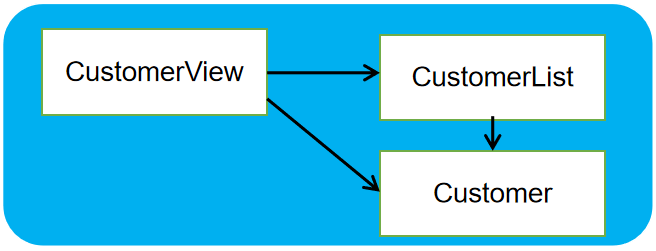
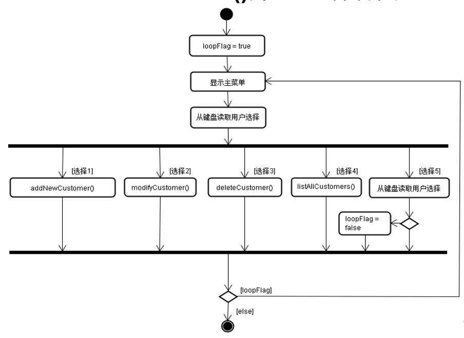

客户信息管理软件
==

# 目 标
* 模拟实现一个基于文本界面的《客户信息管理软件》
* 进一步掌握编程技巧和调试技巧，熟悉面向对象编程
* 主要涉及以下知识点：
    * 类结构的使用：属性、方法及构造器
    * 对象的创建与使用
    * 类的封装性
    * 声明和使用数组
    * 数组的插入、删除和替换
    * 关键字的使用：this

# 需求说明
```text
模拟实现基于文本界面的《客户信息管理软件》。
该软件能够实现对客户对象的插入、修改和删除（用数组实现），并能够打印客户明细表。
项目采用分级菜单方式。主菜单如下：
-----------------客户信息管理软件-----------------

                     1 添 加 客 户
                     2 修 改 客 户
                     3 删 除 客 户
                     4 客 户 列 表
                     5 退           出

                     请选择(1-5)：_

```
* 每个客户的信息被保存在Customer对象中。
* 以一个Customer类型的数组来记录当前所有的客户。
* 每次“添加客户”（菜单1）后，客户（Customer）对象被添加到数组中。
* 每次“修改客户”（菜单2）后，修改后的客户（Customer）对象替换数组中原对象。
* 每次“删除客户”（菜单3）后，客户（Customer）对象被从数组中清除。
* 执行“客户列表 ”（菜单4）时，将列出数组中所有客户的信息。
*“ 添加客户”的界面及操作过程如下所示：
```text
                   请选择(1-5)：1

---------------------添加客户---------------------
姓名：xx
性别：男
年龄：35
电话：010-56253825
邮箱：tongtong@atguigu.com
---------------------添加完成---------------------

```
* “修改客户”的界面及操作过程如下所示：
```text
                   请选择(1-5)：2

---------------------修改客户---------------------
请选择待修改客户编号(-1退出)：1
姓名(佟刚)：<直接回车表示不修改>
性别(男)：
年龄(35)：
电话(010-56253825)：
邮箱(tongtong@atguigu.com)：tongg@atguigu.com
---------------------修改完成---------------------

```
* “删除客户”的界面及操作过程如下所示：
```text
                   请选择(1-5)：3

---------------------删除客户---------------------
请选择待删除客户编号(-1退出)：1
确认是否删除(Y/N)：y
---------------------删除完成---------------------
```

* “客户列表”的界面及操作过程如下所示：
```text
 				请选择(1-5)：4

---------------------------客户列表---------------------------
编号  姓名       性别    年龄   电话                   邮箱
1     佟刚       男      45     010-56253825   tong@abc.com
2     封捷       女      36     010-56253825   fengjie@ibm.com
3     雷丰阳     男      32     010-56253825   leify@163.com
-------------------------客户列表完成-------------------------

```

# 软件设计结构
该软件由以下三个模块组成：
  

* CustomerView为主模块，负责菜单的显示和处理用户操作
* CustomerList为Customer对象的管理模块，内部用数组管理一组Customer对象，并提供相应的添加、修改、删除和遍历方法，供CustomerView调用
* Customer为实体对象，用来封装客户信息

# enterMainMenu()方法的活动图
  

# 类设计
## 第1步—实现Customer类
* 按照设计要求编写Customer类，并编译
* 在Customer 类中临时添加一个main方法中，作为单元测试方法。
	在方法中创建Customer对象，并调用对象的各个方法，以测试该类是否编写正确。
	
## 第2步—CustomerList类的设计
* CustomerList为Customer对象的管理模块，内部使用数组管理一组Customer对象
* 本类封装以下信息：
```text
Customer[] customers：用来保存客户对象的数组
int total = 0                 ：记录已保存客户对象的数量
```
* 该类至少提供以下构造器和方法：
```text
public CustomerList(int totalCustomer) 
public boolean addCustomer(Customer customer) 
public boolean replaceCustomer(int index, Customer cust)
public boolean deleteCustomer(int index)
public Customer[] getAllCustomers() 
public Customer getCustomer(int index) 
public int getTotal()

public CustomerList(int totalCustomer) 
用途：构造器，用来初始化customers数组
参数：totalCustomer：指定customers数组的最大空间

public boolean addCustomer(Customer customer) 
用途：将参数customer添加到数组中最后一个客户对象记录之后
参数：customer指定要添加的客户对象 
返回：添加成功返回true；false表示数组已满，无法添加

public boolean replaceCustomer(int index, Customer cust)
用途：用参数customer替换数组中由index指定的对象
参数：
    customer指定替换的新客户对象 
    index指定所替换对象在数组中的位置，从0开始
返回：替换成功返回true；false表示索引无效，无法替换

public boolean deleteCustomer(int index)
用途：从数组中删除参数index指定索引位置的客户对象记录
参数： index指定所删除对象在数组中的索引位置，从0开始
返回：删除成功返回true；false表示索引无效，无法删除

public Customer[] getAllCustomers() 
用途：返回数组中记录的所有客户对象
返回： Customer[] 数组中包含了当前所有客户对象，该数组长度与对象个数相同。

public Customer getCustomer(int index) 
用途：返回参数index指定索引位置的客户对象记录
参数： index指定所要获取的客户在数组中的索引位置，从0开始
返回：封装了客户信息的Customer对象

```

### 测试CustomerList类
* 按照设计要求编写CustomerList类，并编译
* 在CustomerList类中临时添加一个main方法中，作为单元测试方法。
* 在方法中创建CustomerList对象（最多存放5个客户对象），然后分别用模拟数据调用以下各个方法，以测试各方法是否编写正确：
    * addCustomer()
    * replaceCustomer()
    * deleteCustomer()
    * getAllCustomers()
    * getCustomer()
    * getTotal()
* 进一步测试以下情况，以验证该类是否编写正确：
    * 调用addCustomer方法，添加至少5个以上客户对象时
    * 当数组中客户对象数量为0时，仍然调用replaceCustomer方法替换对象
    * 当数组中客户对象数量为0时，仍然调用deleteCustomer方法删除对象
    * 对于replaceCustomer、 deleteCustomer和getCustomer的调用，当参数index的值无效时（例如-1或6）
    * getAllCustomers方法返回的数组长度是否与实际的客户对象数量一致

## 第3步—CustomerView类的设计
* CustomerView为主模块，负责菜单的显示和处理用户操作
* 本类封装以下信息：
```text
CustomerList customerList = new CustomerList(10);
创建最大包含10个客户对象的CustomerList 对象，供以下各成员方法使用。
```
* 该类至少提供以下方法：
```text
public void enterMainMenu() 
private void addNewCustomer() 
private void modifyCustomer()
private void deleteCustomer()
private void listAllCustomers()
public static void main(String[] args)

public void enterMainMenu() 
用途：显示主菜单，响应用户输入，根据用户操作分别调用其他相应的成员方法（如addNewCustomer），以完成客户信息处理。

private void addNewCustomer() 
private void modifyCustomer()
private void deleteCustomer()
private void listAllCustomers()
用途：这四个方法分别完成“添加客户”、“修改客户”、“删除客户”和“客户列表”等各菜单功能。
	这四个方法仅供enterMainMenu()方法调用。

public static void main(String[] args)
用途：创建CustomerView实例，并调用 enterMainMenu()方法以执行程序。

```

### 测试
* 按照设计要求编写CustomerView类，逐一实现各个方法，并编译
* 执行main方法中，测试以下功能：
* 主菜单显示及操作是否正确
```text
“添加客户”操作是否正确，给用户的提示是否明确合理；测试当添加的客户总数超过10时，运行是否正确
“修改客户”操作是否正确，给用户的提示是否明确合理；
“删除客户”操作是否正确，给用户的提示是否明确合理；
“客户列表”操作是否正确，表格是否规整；
```

* 思考以下问题：
当软件退出时，所有客户信息便丢失了！运用什么手段可以将这些信息长久保存，以便在下一次运行软件时继续使用？

